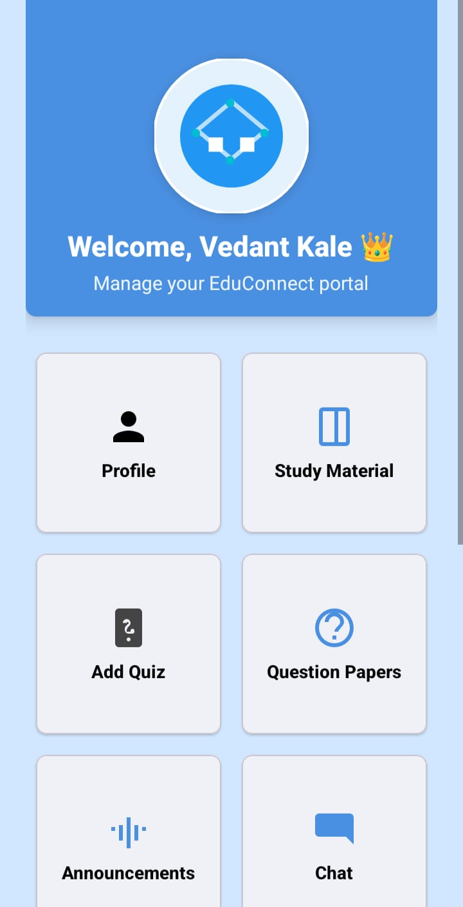
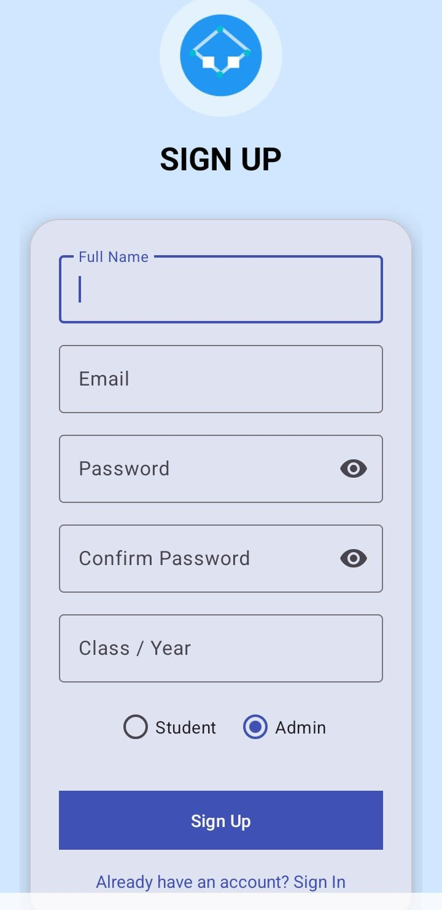
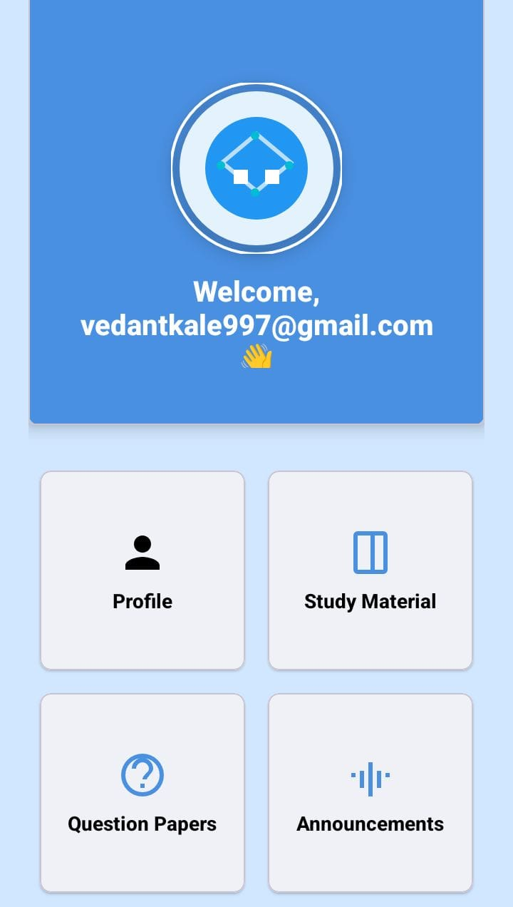
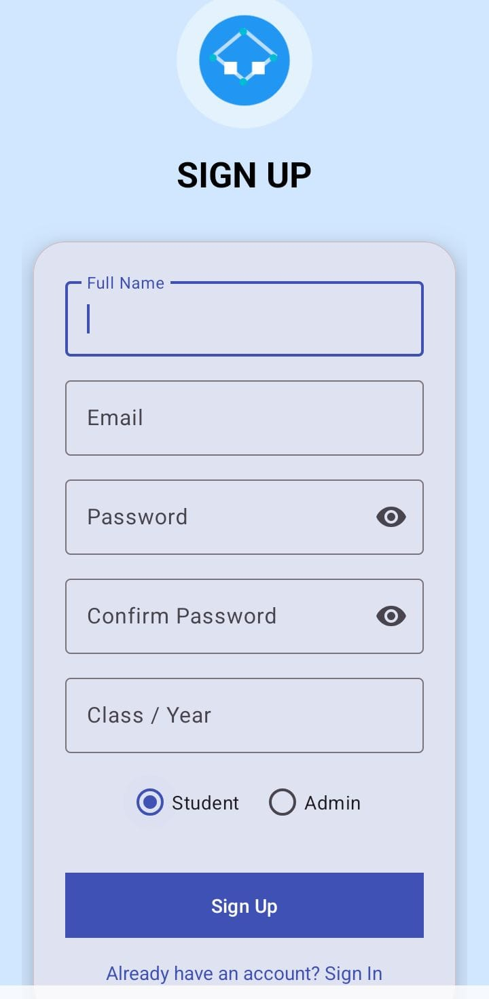
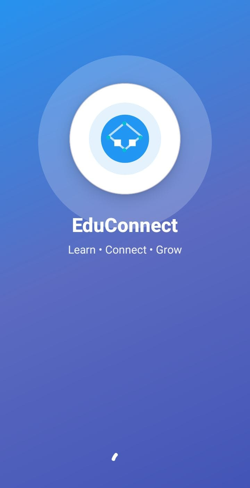

# EduConnect – Android Application

## 📌 Project Overview
EduConnect is a college-level Android application developed to improve digital communication and learning between **students and administrators**.  
The application provides role-based access with **Admin** and **Student** dashboards, enabling academic management, interaction, and learning resources in one platform.

---

## 👥 User Roles
The application has **two types of users**:

### 🔑 1. Admin
Admins manage academic content and student activities.

### 🎓 2. Student
Students access learning materials, quizzes, announcements, and group discussions.

---

## 🛠️ Admin Features
- Admin Login
- Admin Dashboard
- Add Announcements
- View Announcements
- Upload Study Materials
- Manage Question Papers
- Create and Manage Quizzes
- View Student Results
- Manage Groups
- Upload Learning Content
- Timetable Management

---

## 🎓 Student Features
- Student Registration & Login
- Student Dashboard
- View Announcements
- Attempt Quizzes
- View Quiz Results & History
- Join Groups
- Group Chat Functionality
- View & Download Study Materials
- View Question Papers
- Reminders & Notifications
- Profile Management
- Timetable View
## 📸 Application Screenshots

### Admin Panel

### Student Panel

### Common

---

## 💬 Communication & Interaction
- Group Creation & Join Group
- Group Chat System
- View Group Members
- Study Group Collaboration

---

## 📚 Learning Modules
- Study Materials Upload & View
- Question Papers Module
- Quiz Module
- Result History
- Reminders for Academic Tasks

---

## 🧑‍💻 Technologies Used
- **Android Studio**
- **Java**
- **XML**
- **Firebase Authentication**
- **Firebase Firestore**
- **Firebase Storage**
- **RecyclerView**
- **GoogleDrive**
- **Material Design Components**

---

## ▶️ How to Run the Project
1. Clone the repository
2. Open the project in **Android Studio**
3. Sync Gradle files
4. Connect Firebase (Auth, Firestore, Storage)
5. Run on Emulator or Android Device

---

## 📦 APK Distribution
The APK file is generated using Android Studio and shared via **Google Drive** for installation on Android devices.

---

## 🎓 Academic Use
This project is developed as a **college Android application project** for academic learning and evaluation purposes.

---

## 👤 Author
**Vedant Kale**
